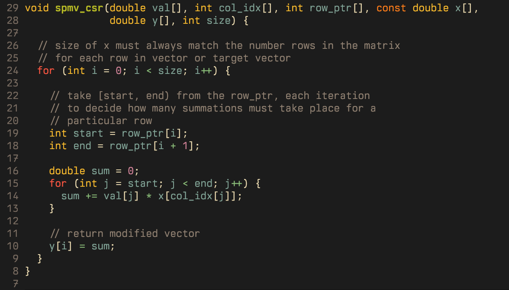
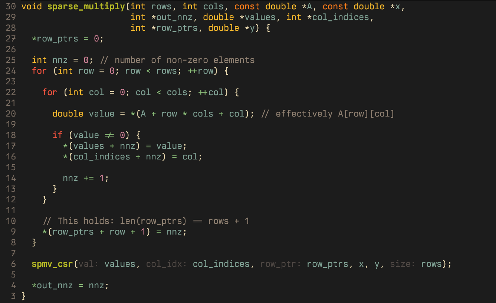
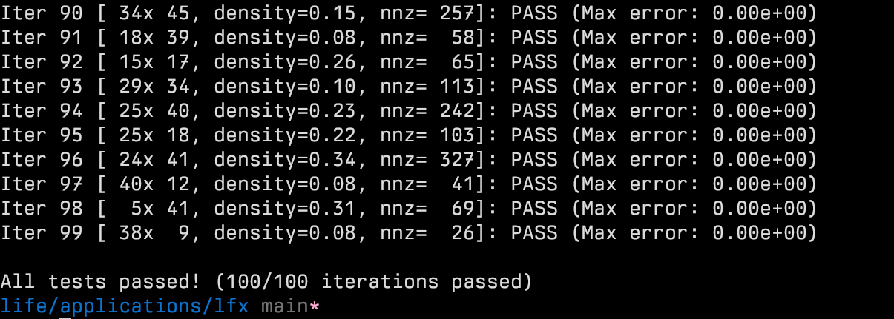

# RV-Sparse Coding Challenge

## Problem

Convert a dense row-major matrix into CSR format and compute **y = A.x** using the extracted sparse representation.

Implement a  function that:

- Scans a row-major matrix A and identifies its non-zero elements.
- Extracts them into Compressed Sparse Row (CSR) format using caller-provided buffers.
- Computes the matrix-vector product **y = A * x** using the extracted CSR data.
- Write the result directly into a caller-provided output buffer.

> Critical constraint:
>
> The function must perform **zero dynamic memory allocation**. All memory is pre-allocated by the caller.

## Representation 

To implement a solution this problem, first I needed to understand what:

- Sparse Matrix is 
- CSR format looks like
- and why is it efficient than normal Matrix Vector multiplication

From my understanding, some descriptions are in order:

**Sparse Matrix**

A matrix where most entries are zero or technically, it is a matrix whose ratio of **zero** elements to **non-zero** elements is > 1, which effectively means that most of its entries are zero.

**CSR Format**

There are numerous ways to store a sparse matrix in memory, such as, Compress Coordinate (COO), Compressed Sparse Column (CSC), and Compressed Sparse Row (CSR) format. We employ CSR format in this problem.

The CSR format uses 3 **arrays** to store complete information of a sparse matrix.

- `values` array contains all **non-zero** elements of the matrix.   
- `column_indices` array stores the **column index** of `values` entries in the 	original dense matrix.   
- `row_ptrs` array defines where **each row starts and ends** inside the `values` array, corresponding to original matrix.   

**Efficiency**

The sparse matrix representation achieves efficiency by completely eliminating the need to process **zero** entries.  Since **zeroed** entries aren't stored, they aren't multiplied with the target vector, saving cycles in proportion to count of **zero** entries.

The following example helped me understand the process a lot better.

###### Example: 

Consider the following loosely sparse matrix:

A = [    
  [10,  0, 20],    
  [ 0, 30,  0],    
  [40,  0, 50]     
]    

can be stored in CSR format as:  

`values`   = [10, 20, 30, 40, 50]   
`col_idx`  = [0, 2, 1, 0, 2]    
`row_ptrs` = [0, 2, 3, 5]   

The `row_ptrs` array works more as a **slicing** guide for `values` array, for example:

first_row = values\[**0:2**\]    
second_row = values\[**2:3**\]    
third_row = values\[**3:5**\]   

## Approach 

This problem consists of two parts: 

 1. Storing the user provided **matrix** (A) into a **sparse matrix** representation
   2. Multiplying the sparse matrix with an **input vector** array.

I personally solved these in reverse order because I first needed the intuition for sparse vector multiplication itself, so I implemented the **spmv_csr** routine first.

###### Sparse Matrix Multiplication

It works as follows:

1. Take in sparse parameters such as **val, col_idx, row_ptr** , input and output vectors: **x,y** and **size** of input/output vector.
2. Each output element **y[i]** is the dot product of row **i** with vector **x**
3. For each entry in **y**, extract **[start,end)** indices from **row_ptr**.
4. Compute **sum** for each entry of **y** by using **col_idx[j]** to select corresponding element from **x** to be multiplied with current element from **values** array.
5. Update output vector with newly computed **sum**. 

I tested this implementation with some examples and it worked! Next I moved on to solving the first part. 

**Sparse Matrix construction**

1. Scan matrix **A** in row-major order.
2. If encounter **non-zero** element:
   1. Append it to **values** array.
   2. Append the current column **col** to **col_indices** array.
   3. Increment **nnz** (non-zero elements count)

Constructing the **row_ptrs** array felt tricky at first. The mismatch between **row_ptrs** and a single **row's** length felt off-putting, but then I reasoned that I can initialize the **row_ptrs** with **0** because every instance would always start with 0, only the later boundaries are not known. With one less runtime assignment, the rest of **row_ptrs** could be filled within the outer loop. 

Therefore:

3. The next boundary is always the current number of non-zero elements (**nnz**) , which I add to **row_ptrs** array after a row is processed.
4. This completes the sparse matrix construction, after which, pass the required arguments to **spmv_csr()** function to perform **sparse multiplication**
5. As final step, update the **out_nnz** variable.

## Problems I faced 

**Information loss (wrong type)**: I declared **sum** in **spmv_csr** as `int` instead of `double` which resulted in test FAILS because the results weren't converging to the tolerable threshold due to loss of information bits. 

**Off-by-one error**: As mentioned above, I got logic for `row_ptrs` wrong by shifting boundaries by one, to the left, so **0th** value was being replaced.

**Incorrect Pointer arithmetic**  I wrote following code to located current non-zero value in the matrix: 

`double value = *(A + row * cols * sizeof(double) + col * sizeof(double));` 

which is **incorrect** because in C/C++, the indexing is already scaled by size of **data-type** being pointed to, whereas I was thinking in terms of per-byte traversal. 

## Space-time complexity 

**Time**: O(nnz) for sparse matrix multiplication

**Space**: O(nnz) for storing in CSR format

This implies that sparser the matrix, the better. **Conversion of dense matrix to CSR is O(rows * cols) though!**

I observed one more thing: *The critical constraint mentioned kind-of made the problem easy for me to reason through because I didn't have to worry about dynamic memory management up front.*

## **Results**

Sparse Multiply 

CSR Construction

**Test results**:

___
***Thank you!***
